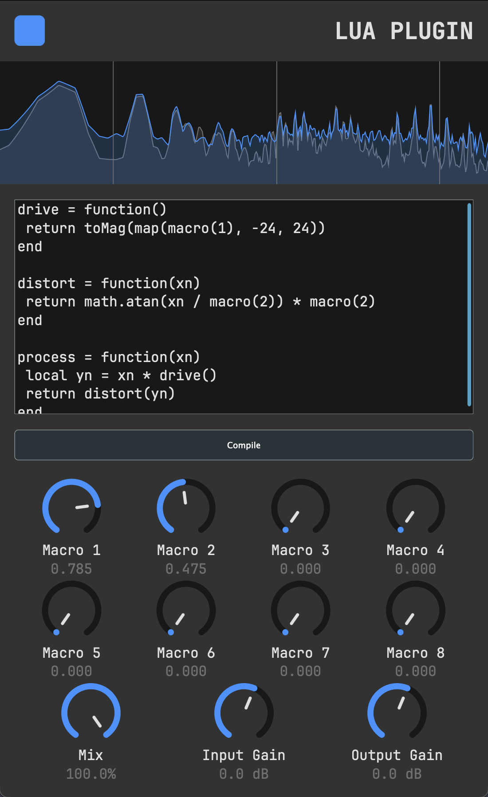

# LUA PLUG

A plugin that allows you to write your own DSP in Lua,
compile it, and run it in realtime all within the plugin!

## Programming in the Plugin

The JIT compiler looks for a function called `process`
that takes a number (for the input sample) and returns
one number (the corresponding output sample).

It also provides a few useful functions:

- `toMag(dB)`: Converts `dB` to a magnitude
- `toDb(mag)`: Converts a magnitude to decibels
- `macro(#)`: get the value (0.0 - 1.0) of macro #
- `map(v, min, max)`: map a 0-1 value `v` from `min` to `max`
- `sampleRate()`: returns the current sample rate
- `getChannel()`: returns the channel of the current sample (0 -> left, 1 -> right)



## Setup

Change the project name and all `juce_add_plugin` fields.

Also, set the `JUCE_PATH` to wherever your JUCE clone is.
If you don't have a local JUCE install, it will fallback
to a FetchContent, so if you don't want multiple copies
of JUCE hanging around your computer, just set `JUCE_PATH`

To generate the compile commands used by clangd, make sure
to run the CMake configure step. (I usually use Ninja.
XCode and MSVC won't generate the clang compile commands!)

```sh
cmake --preset config
```

## Building (on my machine, at least)

```sh
cmake --build --prest debug
```

```sh
cmake --build --preset release
```
